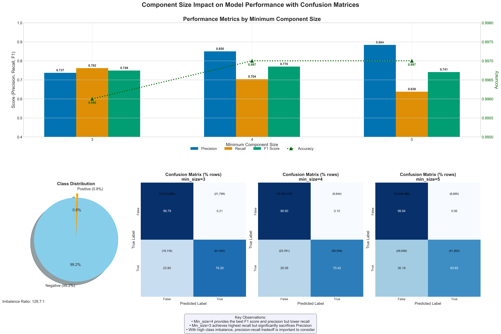

# Scratch Detection in Semiconductor Wafers

This repository contains a data science project focused on detecting scratches on semiconductor wafers. The goal is to build a model to automate this detection process, improving quality control and efficiency in semiconductor manufacturing.

---

## Table of Contents

- [Introduction](#introduction)
- [Project Goals](#project-goals)
- [Exploratory Data Analysis](#exploratory-data-analysis)
- [Modeling and Methodology](#modeling-and-methodology)
  - [Approach 1: XGBoost with Upsampling](#approach-1-xgboost-with-upsampling)
  - [Approach 2: Connected Components Algorithm](#approach-2-connected-components-algorithm)
- [Results and Discussion](#results-and-discussion)
- [Conclusion and Future Work](#conclusion-and-future-work)

---

## Introduction

In the semiconductor industry, wafers are thin discs used to fabricate microelectronic devices. A single wafer contains thousands of individual dies. A critical challenge in manufacturing is identifying defects like scratches—elongated clusters of bad dies that can compromise device performance.

These scratches can be caused by equipment misalignment or handling errors. The process of identifying them often involves manually marking good dies that lie within a scratch's path for removal, a process called **"inking."** This manual process is expensive, time-consuming, and prone to human error.

*Fig.1 - A wafer map showing good dies (green), bad dies (red), scratch dies (blue), and inked dies (yellow).*

---

## Project Goals

The primary goal is to automate the scratch detection process to achieve the following:

- **Automation**: Replace the manual, expensive, and slow procedure with a fast, automated system.
- **Quality**: Improve the quality of dies by accurately identifying scratches while balancing against yield loss (i.e., not incorrectly removing too many good dies).
- **Prediction Level**: Provide predictions at both the individual die level and the overall wafer level.

---

## Exploratory Data Analysis

The dataset consists of wafer maps from **4,655 wafers**.

### Key Findings

- **Class Imbalance**: The dataset is highly imbalanced, with scratch dies making up only **0.77%** of the total dies in the training set.
- **Yield Variability**: The test set exhibits a wider range of wafer yields compared to the training set, indicating greater variability in quality.
- **Spatial Patterns**: Scratches are not random. Heatmaps show they tend to occur in specific regions, suggesting systematic issues as a potential cause.

*Fig.2 - Aggregated wafer map showing a higher concentration of bad dies in specific regions.*

*Fig.3 - Bad die distribution across six sample wafers, highlighting clusters.*

---

## Modeling and Methodology

Two primary approaches were developed to address the problem.

### Approach 1: XGBoost with Upsampling

An initial XGBoost model trained on the raw, imbalanced data failed to learn, predicting every die as non-scratched. To counter this, the minority class (scratched dies) was upsampled. This improved recall but resulted in very poor precision (**0.18**), meaning the model incorrectly flagged far too many good dies as scratched.

*Fig.4 - Classification report from the upsampled XGBoost model, showing high recall but very low precision on the holdout set.*

---

### Approach 2: Connected Components Algorithm

This approach leverages the geometric definition of a scratch: an **elongated cluster of bad dies**.

1. **Graph Creation**: Bad dies are treated as nodes in a graph, with edges connecting adjacent dies.
2. **Component Identification**: A connected components algorithm identifies all clusters of bad dies.
3. **Filtering**: Clusters smaller than a `min_size` threshold are filtered out, as they are unlikely to be scratches.
4. **Inking Simulation**: Good dies located on the path between identified scratch clusters are also flagged, simulating the manual "inking" process.

---

## Results and Discussion

The connected components approach proved far more effective at balancing the trade-off between finding scratches and preserving good dies. The model's behavior was tuned by adjusting the `min_size` parameter.

*Fig.5 - Performance metrics with varying `min_size`. The model with `min_size=4` achieves the highest F1-score.*

### Key Takeaways

- **Precision-Recall Trade-off**: A smaller `min_size` (e.g., 4) maximizes recall at the cost of precision, while a larger `min_size` (e.g., 5) does the opposite.
- **Optimal Model Selection**: The F1-score was chosen as the primary metric to balance this trade-off. The model with `min_size=4` achieved the highest F1-score of **0.77**, providing the best overall performance.
- **Alignment with Business Goals**:  
  - If **missing a scratch** is more costly, a lower `min_size` is better.  
  - If **wasting a good die** is more costly, a higher `min_size` is preferred.  
  - For this project, the **balanced model** (`min_size=3`) was selected.

---

## Conclusion and Future Work

The graph-based connected components algorithm successfully automated scratch detection with a strong, tunable balance between precision and recall. It significantly outperformed a standard classification model by incorporating the inherent **spatial nature** of the problem.

### Future Enhancements

- **Advanced Inking Algorithm**: Develop a more sophisticated path-finding algorithm to improve the accuracy of inking simulation.
- **Cost-Sensitive Learning**: Train a model using a cost matrix that reflects the real-world financial impact of false positives vs. false negatives.
- **Hybrid Model**: Combine the two approaches by using features generated from the connected components algorithm (e.g., `cluster_size`) to train a more powerful XGBoost classifier.
